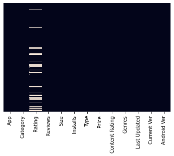
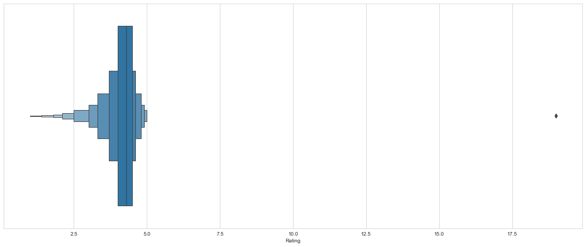
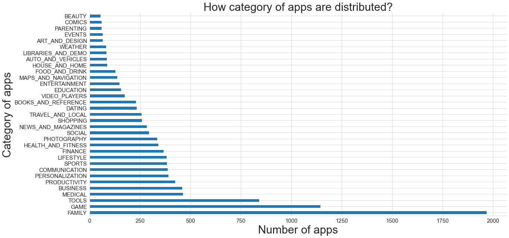
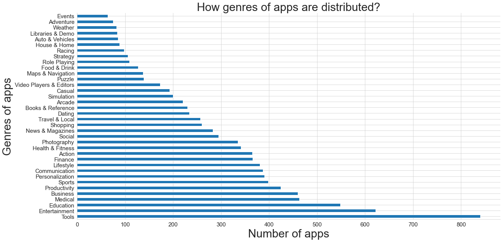
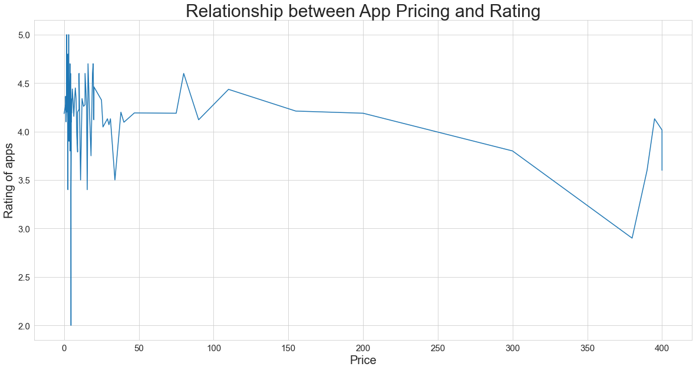
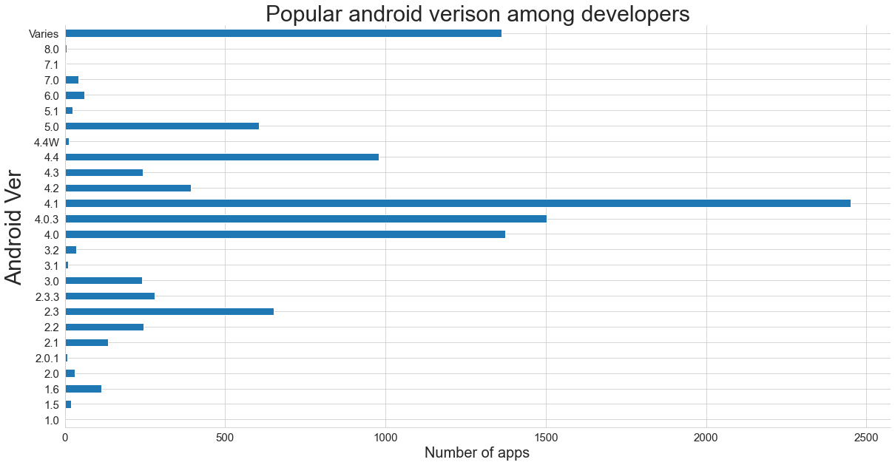
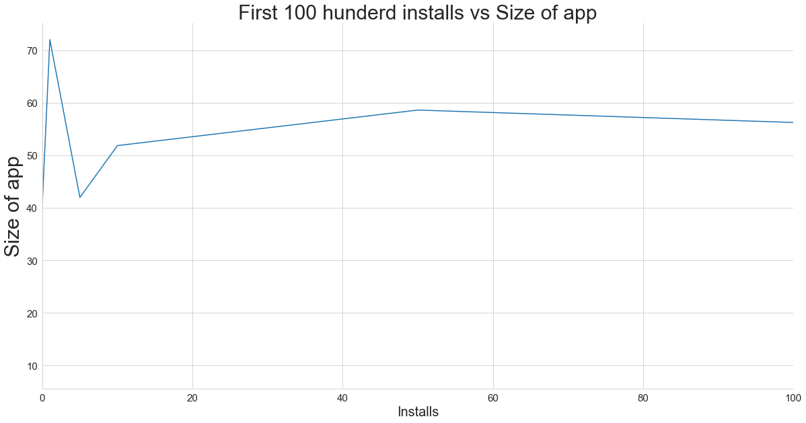
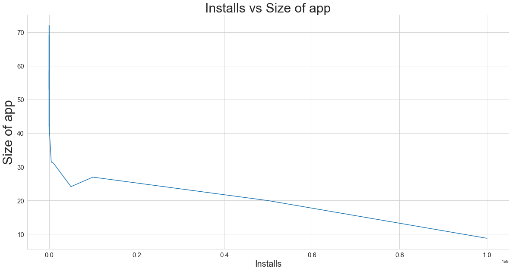
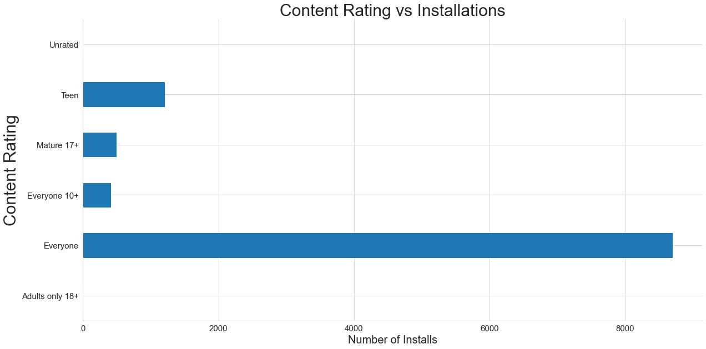
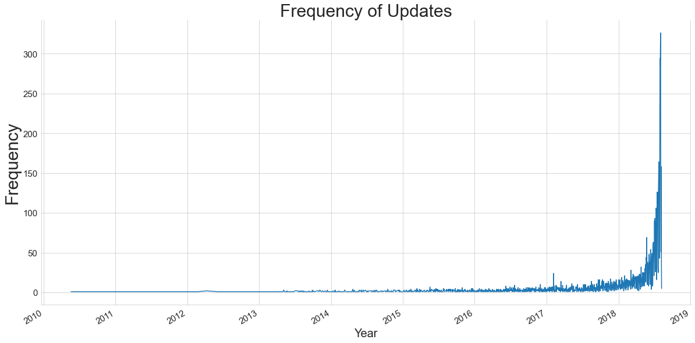

# Google PlayStore Apps Analysis

This is my analysis of the Dataset published on Kaggle as [Google Play Store Apps](https://www.kaggle.com/lava18/google-play-store-apps). Google play store is the leading app store among it's competitors such as Aptiode, 1Mobile Market, or Samsung Galaxy Apps and has an approximate [70% market capture](https://techcrunch.com/2018/10/22/a-look-at-the-android-market-aka-google-play-on-its-10th-anniversary/). 

I did my analysis on the dataset created on the basis of information available on store and here are my insightful findings. If you want to view full notebook click [here](https://www.kaggle.com/kaustubh18282/google-playstore-apps-analysis)

## Understanding the Parameters
- App: Name of the App
- Category: There are various categories available on Google Play store like 'ART_AND_DESIGN', 'AUTO_AND_VEHICLES', 'BEAUTY',
'BOOKS_AND_REFERENCE', 'BUSINESS', 'COMICS' etc.
- Rating: The rating given by user in form of stars. Maximum stars allowed are 5.        
- Reviews: Here reviews indicate number of reviews an app has got.
- Size: The memory size of the app in MegaBytes           
- Installs: Number of installs of an app. In this dataset, exact number of installations are not mentioned and instead a range of values are given.
- Type: Whether the app is Paid or Free
- Price: Self explanotory term but this is in terms of $
- Content Rating: It is the rating according to the usage of app whether it is suited for everyone or adults only. The dataset has 6 such categories.
- Genres: What type of Genre the app belongs to. There are manu genres mentioned in the dataset
- Last Updated: Date when the app was updated on Play store.   
- Current Ver: Current version of the app
- Android Ver: The minimum andriod version where the app would support. Lower is the bettter but as we go down, the usability decreases.

## Problems Faced
- There were a lot of missing values in the ratings column as users are often given choice to rate an app. Here is the visual presentation of that:

- To resolve this I filled the null values with the average rating of their category. Reasons for that were:
    - There were less categories than genres
    - The % of missing values was upto 16% and it's quite a larger value. 
    - The averall averge would be unfair for apps which are generally rated low in their category. But it could also be the case where the app which is not so great is rated high due to it's category but to move ahead in my analysis I took a risk to take average of categories.

- The outlier in the rating app needed to be removed completely as the rating on Google App Store in between 1-5 stars. The box plot to determine this was this:

- The dataset parameters were not in the correct data type and needed a thorough transformation before analysis.

- Another challenge I faced was to determine which parameters should be compared with whom. This will come with practise and I will try to derive more insights in the future datasets.

Let's take a look at my findings:

## Which Category is most popular on Google Play Store?

Most of the apps in this dataset belong to Family category followed by Games and Tools

## Which Genre is most popular on Google Play Store?

This data set has more Tools, Entertainment and education related apps

## Is there any relation between Rating and Pricing of an App ?

It becomes very clear that high rated apps are mostly free apps. Also it gives a interesting fact that paid apps are not necessarly high rated instead they received low rating.

## Which android verison developers are targetting for apps?

Developers are building apps with minimum requirement of android version 4.1 (Jelly bean)

## Is there any relationship between size of app and number of installations?
If we compare first 100 installations with the size of app we get this type of trend:

But if we compare this trend with 100 million installs then the trend is quiet different:

Light weight apps are more installed by users than heavy. Contrary to this is the number of installs of games like PUBG which are very apps but still get a lot of installs.

## Relation between App rating (in terms of content) and Installations

It is clear that people are mostly inclinded towards apps which are rated for everyone use. Maybe most of the app developers are not creating adult/mature rated apps or audience is not downloading these apps from play store and rather than from 3-rd party sources.

## How much the apps are getting updates in the recent years?

This maybe a bias graph as the data provided is not updated but we can conclude this that the frequency of apps updates have improved in the upcoming years. This can also be linked to increase of number of apps in the recent years